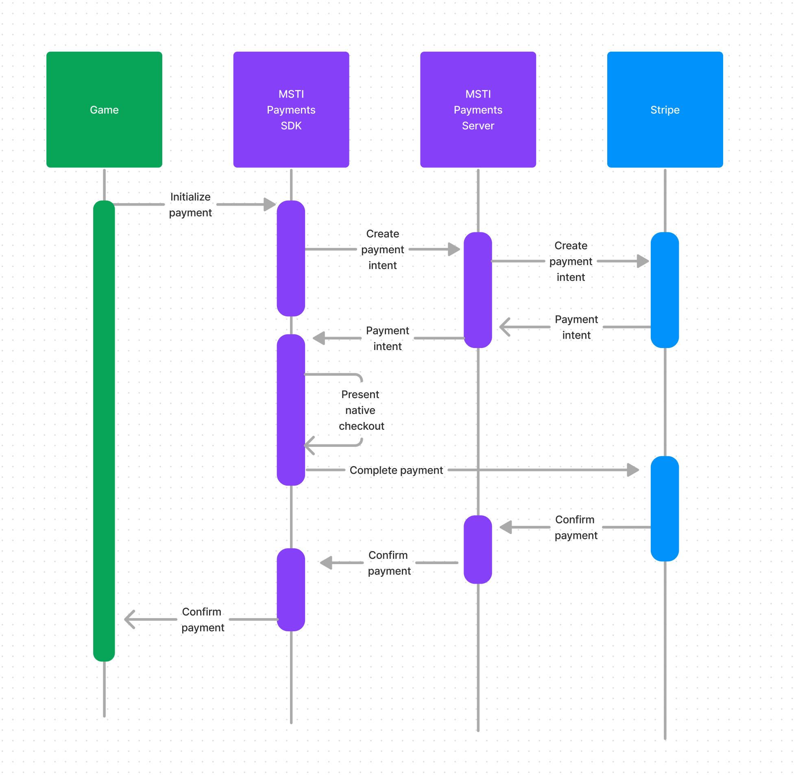

### Android Payments SDK
Payments SDK offers alternative to Google Play Service billing by integrating MSTI Payments for sideload games.

The SDK uses [Stripe](https://stripe.com) to deliver seemless checkout experience with industry-leading conversion rates, ensuring your sideload game maximizes its monetization potential.

Any game that uses Unity IAP package can complete integration within hours. See our [Integration guide](android-sdk.md)

